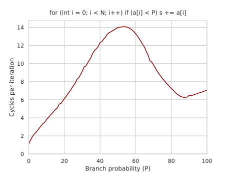
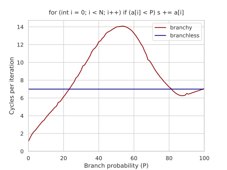

## Ch3: Instruction-Level Parallelism

Modern CPUs use pipelining: after an instruction passes through the first stage, they start processing the next one right away, without waiting for the previous one to fully complete.

### 3.1: Pipeline Hazards

The next instruction might not execute on the following clock cycle:

- A structural hazard happens when two or more instructions need the same part of CPU (e.g., an execution unit).
- A data hazard happens when you have to wait for an operand to be computed from some previous step.
- A control hazard happens when a CPU can’t tell which instructions it needs to execute next.

### 3.2: The Cost Of Branching

```cpp
volatile int s;

for (int i = 0; i < N; i++)
    if (a[i] < 50)
        s += a[i];
```
~14 CPU Cycles per element

Replacing the hardcoded 50 with a tweakable parameter P that effectively sets the probability of the < branch:

```cpp
    for (int i = 0; i < N; i++)
    if (a[i] < P)
        s += a[i];
```



Note that it costs almost nothing to check for a condition that never or almost never occurs.

Pattern Detection:

```cpp
for (int i = 0; i < N; i++)
    a[i] = rand() % 100;

std::sort(a, a + n);
```

Hinting Likeliness of Branches:

```cpp
for (int i = 0; i < N; i++)
    if (a[i] < P) [[likely]]
        s += a[i];
```

Read more: [stackoverflow](https://stackoverflow.com/questions/11227809/why-is-conditional-processing-of-a-sorted-array-faster-than-of-an-unsorted-array)

### 3.3: Branchless Programming

#### Predication:

```cpp
for (int i = 0; i < N; i++)
    s += (a[i] < 50) * a[i];
```

~7 cycles per element instead of the original ~14.

Explanation:
If the expression `a[i] - 50` is negative (implying `a[i] < 50`), then the highest bit of the result will be set to one, which we can then extract using a right-shift.

```asm
mov  ebx, eax   ; t = x
sub  ebx, 50    ; t -= 50
sar  ebx, 31    ; t >>= 31
imul  eax, ebx   ; x *= t
```

Compiler produces:

```asm
    mov     eax, 0
    mov     ecx, -4000000
loop:
    mov     esi, dword ptr [rdx + a + 4000000]  ; load a[i]
    cmp     esi, 50
    cmovge  esi, eax                            ; esi = (esi >= 50 ? esi : eax=0)
    add     dword ptr [rsp + 12], esi           ; s += esi
    add     rdx, 4
    jnz     loop                                ; "iterate while rdx is not zero"
```

Using predication eliminates a control hazard but introduces a data hazard. Cheaper pipeline stall: wait for cmov to be resolved and not flush the entire pipeline in case of a mispredict.

It can be more efficient to leave branchy code as it is: the cost of computing both branches instead of just one outweighs the penalty for the potential branch mispredictions.



Example: branchless cpp lower_bound(int x)

```cpp
int lower_bound(int x) {
    int *base = t, len = n;
    while (len > 1) {
        int half = len / 2;
        base += (base[half - 1] < x) * half; // will be replaced with a "cmov"
        len -= half;
    }
    return *base;
}
```

on small arrays (that fit into cache) it works ~4x faster than the branchy `std::lower_bound`.
